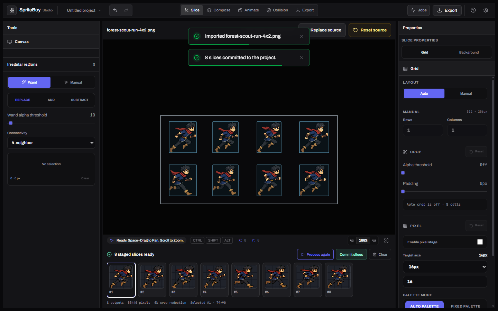
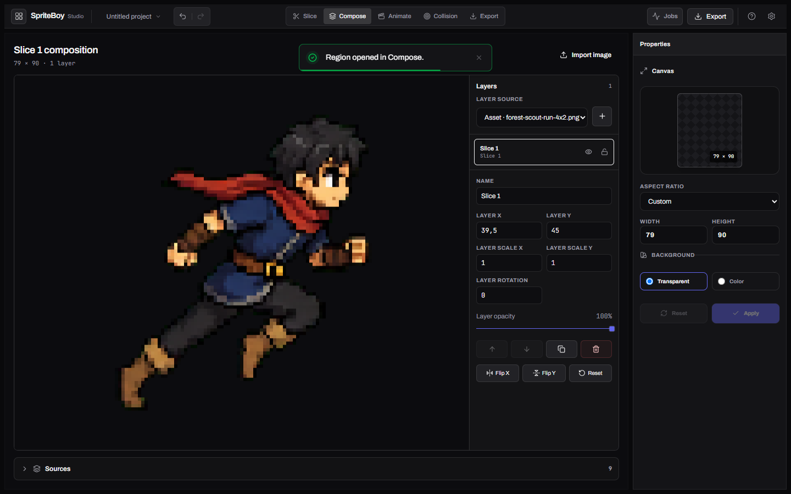
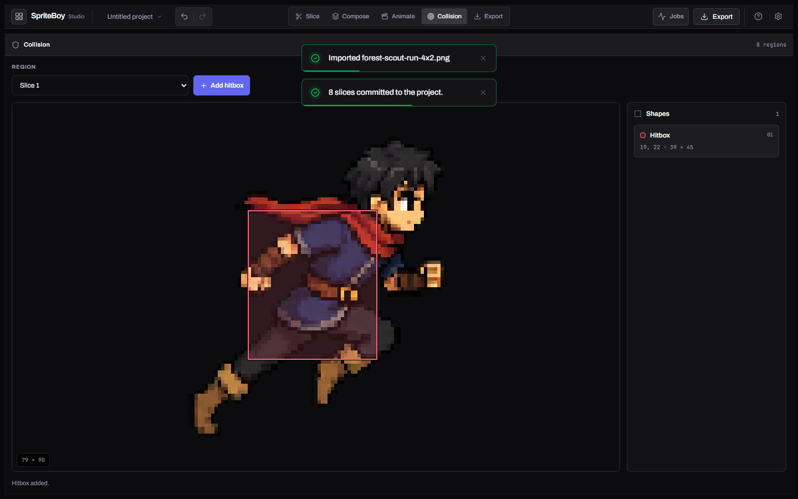
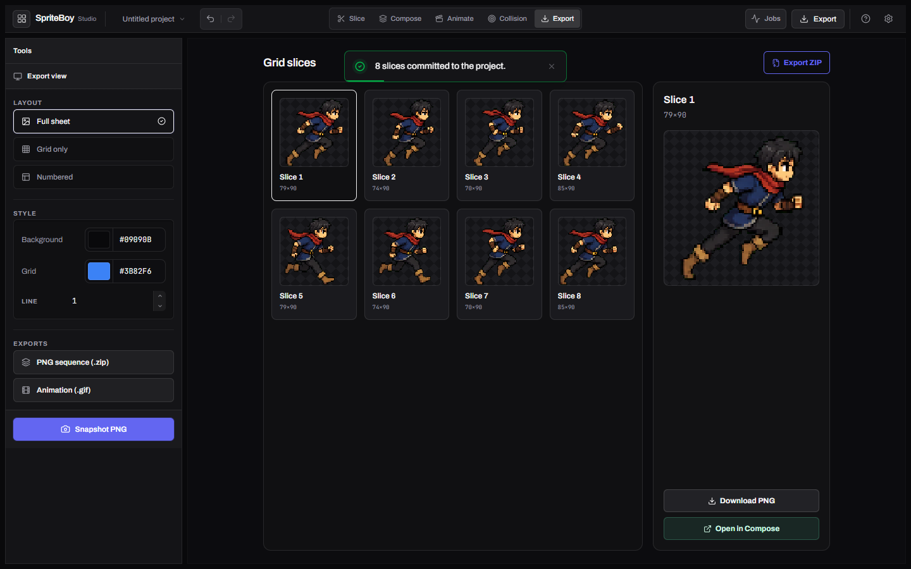

<p align="center">
  <picture>
    <source media="(prefers-color-scheme: dark)" srcset="https://shieldcn.dev/header/document.svg?title=SpriteBoy+Studio&subtitle=Slice.+Compose.+Animate.+Export.&logo=grid3x3&theme=purple&align=center&mode=dark" />
    
  </picture>
</p>

<p align="center">
  <a href="https://github.com/gvastethecreator/sprite-boy/actions/workflows/studio-quality.yml"></a>
  <a href="https://gvastethecreator.github.io/sprite-boy/"></a>
  <a href="https://bun.sh/"></a>
  <a href="#product-tour"></a>
  <a href="LICENSE"></a>
</p>

Local-first sprite sheet editor, animation sequencer, collision workspace, and composition tool built with React 19 and Canvas 2D.

[Project site](https://gvastethecreator.github.io/sprite-boy/) · [Install](#getting-started) · [Contributing](CONTRIBUTING.md) · [Sponsor](https://github.com/sponsors/gvastethecreator) · [Ko-fi](https://ko-fi.com/gvaste)

## Product tour

These captures come from the real forest-scout browser journey and the committed quality fixture. They show rendered pixels and working product states, not presentation mockups.

| Slice and stage | Compose a region |
| --- | --- |
|  |  |
| **Draw collision data** | **Review and export** |
|  |  |

## Features

- **Builder Mode** – Compose sprite sheets by placing assets on a grid or freeform canvas
- **Slicer Tools** – Auto-detect sprites via BFS, dynamic manual grids with canvas divider resizing, and background removal (chroma/luma key)
- **Animation Editor** – Keyframe-based sequencer with real-time preview, onion skinning, and dual-view playback
- **Collision Editor** – Define hitboxes (hurtbox, hitbox, solid, trigger) per frame
- **Export** – PNG, spritesheet ZIP, GIF, and code export (JSON, Phaser 3, Godot)
- **Persistent Storage** – IndexedDB-backed asset library with default SVG assets

## Tech Stack

| Layer           | Tool                                |
| --------------- | ----------------------------------- |
| Runtime         | React 19 + TypeScript 7             |
| Bundler         | Vite 8 (Rolldown)                   |
| Styling         | Tailwind CSS 4 (design-token based) |
| Animation       | GSAP 3, CSS keyframes               |
| Testing         | Vitest 4 + Testing Library          |
| Linting         | OXC (oxlint)                        |
| Package Manager | Bun 1.3.14                          |

## Getting Started

### Prerequisites

- [Bun](https://bun.sh/) 1.3.14
- Node.js 24+

### Install

```bash
bun install --frozen-lockfile --ignore-scripts
```

### Development

```bash
bun run dev        # Start dev server at http://localhost:3000
```

### Build

```bash
bun run build      # Production build → dist/
bun run preview    # Preview production build
```

### Testing

```bash
bun run test            # Run tests once
bun run test:watch      # Watch mode
bun run test:coverage   # Coverage report
```

### Linting and type checking

```bash
bun run lint        # OXC linter
bun run lint:fix    # Auto-fix lint issues
bun run typecheck   # TypeScript type check
bun run check       # Both typecheck + lint
```

### Studio quality gates

```bash
bun scripts/studio-gates.mjs --gate reproducibility
bun scripts/studio-gates.mjs --gate all
bun scripts/studio-gates.mjs --gate e2e
```

The tracked `bun.lock` is authoritative. CI rejects manifest/lock drift, high or
critical dependency advisories, and any failing Studio gate.

### Logging

All scripts have `:log` variants that save output to `logs/`:

```bash
bun run build:log   # → logs/build.log
bun run test:log    # → logs/test.log
bun run lint:log    # → logs/lint.log
```

## Project Structure

```
├── index.html / index.tsx / index.css
├── App.tsx                 # App shell and providers
├── core/                   # Project engine, stores, persistence, render, export, processing
├── features/
│   ├── slice/              # Source session, grid pipeline, irregular tools, grid export
│   ├── compose/            # Composition bootstrap + canvas settings
│   └── collision/          # Collision surface
├── components/
│   ├── layout/             # AppLayout, sidebars, timeline panel
│   ├── canvas/             # CanvasArea, toolbar, status
│   ├── studio/             # StudioHeader, JobCenter, dialogs, workspace chrome
│   ├── overlays/           # Export, Settings, Help, palette, toasts
│   ├── panels/             # Left/right inspectors
│   └── common/             # Shared controls
├── contexts/               # Project and studio providers
├── hooks/                  # Controller and canvas hooks
├── types/                  # Shared types and enums
├── utils/                  # Algorithms, render helpers, db, export formats
├── tests/                  # Vitest contract/hooks/components/integration
├── scripts/                # studio-gates and quality smoke
└── docs/                   # Changelog, project site, and screenshots
```

## VS Code Tasks

Open the Command Palette (`Ctrl+Shift+P`) → **Tasks: Run Task**:

| Task | Description |
| --- | --- |
| 🚀 Dev | Start the Vite dev server |
| 🧪 Test | Run Vitest once and log to `logs/` |
| 👀 Test Watch | Watch mode |
| 🧹 Lint | Run oxlint and log to `logs/` |
| 🔧 Lint Fix | Auto-fix lint |
| 🧠 Typecheck | TypeScript check |
| ✅ Check | Typecheck + lint |
| 🏗️ Build | Production build and log to `logs/` |
| 📊 Coverage | Coverage report |
| 👁️ Preview | Preview the production build |
| 🚪 Studio Gates | `bun scripts/studio-gates.mjs --gate all` |
| 🌐 E2E Gate | Browser E2E gate (needs Chrome) |
| 🗑️ Clean | Remove `dist/` and `logs/` |

## License

Released under the [MIT License](./LICENSE). See the file for the full text.

## Support

If SpriteBoy helps your asset workflow, you can [sponsor ongoing maintenance](https://github.com/sponsors/gvastethecreator) or [support continued development on Ko-fi](https://ko-fi.com/gvaste). Focused bug reports and pull requests are welcome through [GitHub Issues](https://github.com/gvastethecreator/sprite-boy/issues).