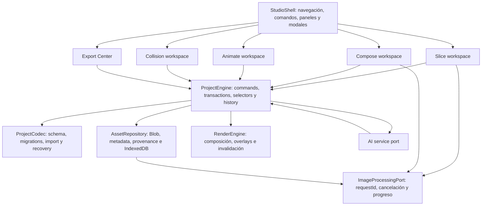

# Integración nativa de Animoto y Grid Splitter

Estado: **listo para ejecución**

La ejecución individual se controla en [TASKS.md](./TASKS.md); este índice y el workplan siguen siendo la autoridad de arquitectura y orden entre slices.

Host: `D:\DEV\sprite-boy`

Donantes de comportamiento: `D:\DEV\animoto`, `D:\DEV\grid-splitter`
Última revisión: 2026-07-13

## Resultado buscado

SpriteBoy Studio será una sola aplicación capaz de importar, cortar, limpiar, componer, generar, animar, definir colisiones, previsualizar y exportar sprites. Animoto y Grid Splitter no se montarán como aplicaciones, rutas, iframes, stores o shells secundarios: se replicará toda su funcionalidad útil sobre el modelo, el diseño visual y las interacciones nativas del Studio.

La paridad se considera alcanzada sólo cuando una persona puede completar en SpriteBoy los mismos trabajos que hoy completa en cada donante, con proyectos persistentes y operaciones combinables en una misma sesión.

## Autoridad documental

Este índice y sus documentos enlazados son la autoridad para la integración. En caso de contradicción, el orden es:

1. Invariantes y vocabulario de este archivo.
2. [WORKPLAN.md](./WORKPLAN.md), que define orden, dependencias y frontier.
3. [FOUNDATION.md](./FOUNDATION.md), para modelo, arquitectura y migración.
4. [ANIMOTO.md](./ANIMOTO.md) y [GRID_SPLITTER.md](./GRID_SPLITTER.md), para paridad funcional y de interfaz.
5. [QUALITY_GATES.md](./QUALITY_GATES.md), para aceptación y evidencia.
6. [HOST_PARITY.md](./HOST_PARITY.md), para no regresión del Studio actual.
7. [TRACEABILITY.md](./TRACEABILITY.md), para source → behavior → slice → journey.
8. [REVIEW_RECORD.md](./REVIEW_RECORD.md), para revisión independiente, autopsia y verdict.
9. Código actual de los tres repositorios, usado como evidencia del comportamiento existente, nunca como permiso para crear una segunda arquitectura.

Los documentos históricos de `docs/` describen el producto actual. Cuando contradigan este plan en conceptos como `FrameData`, persistencia, historial o modos, este plan gobierna la migración y esos documentos deberán actualizarse en el slice correspondiente.

## Alcance y exclusiones

Incluido:

- Paridad completa de slicing, composición por capas, variantes, generación, edición de secuencias, playback, colisiones y exportación.
- Adaptación de cada interfaz al shell, tokens, canvas, inspectores, timeline, modales, comandos y feedback de SpriteBoy.
- Modelo canónico, persistencia versionada, migraciones, undo/redo transaccional, worker robusto, accesibilidad, rendimiento, pruebas y rollout.
- Reutilización o portado de algoritmos del código propiedad del usuario cuando sea conveniente.

Excluido:

- Incrustar `animoto` o `grid-splitter`, importar sus `App`, montar sus providers o mantener sus stores en paralelo.
- Conservar sus marcas, landing pages, navegación, fondos decorativos o estilos globales como subproductos visibles.
- Compatibilidad binaria con sus estados internos. La compatibilidad se ofrece mediante importadores explícitos y migraciones al esquema Studio.
- Análisis de licencias entre estos tres repositorios; el usuario confirmó la propiedad de ambos donantes.

## Baseline verificado

| Superficie | Evidencia actual | Implicación para el plan |
|---|---|---|
| SpriteBoy | typecheck, 57 tests y build pasan; 8.75% de líneas cubiertas; lint reporta 144 warnings; bundle principal ~842 kB | No apilar features sobre el controller/context actual; crear foundation y gates antes de paridad |
| Animoto | typecheck, lint, build y 4 tests pasan; 2.09% de líneas cubiertas; editor e importación funcionan en navegador | Fuente de comportamiento/UI, no de confianza de regresión; cada port necesita pruebas nuevas |
| Grid Splitter | typecheck, lint, build y 58 tests pasan; 80.75% de líneas cubiertas; split 3x3 funciona en navegador | Algoritmos reutilizables, pero el protocolo del worker debe endurecerse antes de integrarlo |
| Persistencia host | JSON directo y URLs de Blob sin codec/versionado | Bloquea proyectos durables y toda edición multicapa |
| Modelo host | `FrameData` es una región de la hoja; en Animoto es una composición con variantes y capas | Requiere vocabulario canónico antes de trasladar componentes |
| Shell host | `COLLISION` existe en tipos/panel, pero no en navegación principal | El nuevo mapa de workspaces debe volver alcanzables todas las capacidades |

## Arquitectura destino

No feature puede escribir directamente en el estado de otra. Toda mutación durable pasa por un comando de `ProjectEngine`; los estados efímeros de puntero, hover, playback, modales y progreso viven fuera del documento serializado.

## Vocabulario canónico

| Concepto | Responsabilidad | No debe contener |
|---|---|---|
| `Asset` | Binario inmutable, MIME, dimensiones, hash, nombre y procedencia | URL de Blob como identidad, selección UI, coordenadas de una celda |
| `Region` | Rectángulo identificado dentro de un `Asset`, pivot sugerido y metadata de extracción | Capas, variante activa o índice como identidad |
| `Composition` | Canvas editable con dimensiones, fondo y lista ordenada de `Layer` | Posición dentro de una secuencia o estado de playback |
| `Layer` | Referencia a `Asset`/`Region`, transform, opacidad, visibilidad y nombre; pertenece a una composición | Binario duplicado, índice de frame global o composition nesting |
| `VariantSet` | Alternativas A/B/C/D de una misma composición y selección activa | Copias implícitas sin procedencia |
| `Cel` | Elemento estable de una secuencia; referencia a `Region`, `Composition` o `VariantSet`, duración y overrides | Geometría fuente embebida o identidad basada en posición |
| `Sequence` | Orden de cels, FPS/default duration, loop y metadata de playback | Cachés renderizados como fuente de verdad |
| `CollisionSet` | Shapes tipados asociados a un cel, región o composición mediante owner estable | Índices de arrays o coordenadas ambiguas |
| `ProcessingRecipe` | Parámetros reproducibles de split, crop, chroma y quantization | Objetos DOM, `ImageBitmap` o URLs temporales |
| `GeneratedArtifact` | Resultado AI/export con modelo, prompt, coste, estado y procedencia | Secretos o estado global del provider |

## Invariantes no negociables

1. Las identidades son strings estables; un índice sólo expresa orden visible.
2. El proyecto serializado nunca contiene `Blob URL`, `HTMLImageElement`, `ImageBitmap`, canvas, worker o caché derivada.
3. Cada asset durable se resuelve mediante `assetId`; los object URLs se crean y revocan en runtime.
4. Undo/redo registra comandos o snapshots estructurados en límites de transacción. Un drag completo produce una sola entrada.
5. Slicing/regeneración que eliminaría owners muestra referencias huérfanas prospectivas y exige cancelar, relinkear o aplicar una cascada legal; nunca persiste dangling refs ni las descarta silenciosamente.
6. Un único engine gobierna proyecto, history, dirty state, autosave y selección durable. No se portan los reducers/stores de los donantes como raíces paralelas.
7. El canvas renderiza por invalidación y playback activo; no mantiene un `requestAnimationFrame` continuo cuando está idle.
8. AI, workers y exportadores son ports cancelables con progreso, error tipado y cleanup.
9. Los workspaces comparten shell y lenguaje visual; la interfaz donante se replica como capacidad, no como skin.
10. Ninguna fase se considera terminada sólo porque compila: requiere evidencia funcional, visual y de recuperación definida en `QUALITY_GATES.md`.
11. `Layer`, `Cel` y `VariantSet` son records normalizados con ownership explícito; duplicar un cel copia su graph editable y comparte sólo assets inmutables.

## Mapa de producto unificado

| Área Studio | Funcionalidad consolidada | Superficie principal |
|---|---|---|
| `Assets` | Importar, validar, organizar, persistir, reemplazar y rastrear procedencia | Sidebar izquierdo y Asset Library |
| `Slice` | Grid manual/automático, detección libre, crop, chroma, quantization, palettes y preview batch | Canvas central + inspector derecho |
| `Compose` | Capas, transform gizmo, guides, visibilidad, orden, duplicado, sync y variantes | Canvas central + Layers + inspector |
| `Animate` | Timeline DnD, selección múltiple, prompts por cel, lock, onion skin, playback, alignment y correction | Timeline inferior + canvas + inspector |
| `Collision` | Hurt/hit/solid/trigger shapes, tags, edición y preview por cel | Canvas + inspector; comando alcanzable en header |
| `AI` | Prompt inteligente, plan, generación sequential/recursive, fill, regenerate y auditoría | Panel contextual y Job Center |
| `Export` | Spritesheet/metadata de engine, ZIP frames, GIF, MP4 y WebM | Modal/Export Center compartido |

`Build` deja de ser una bolsa ambigua: conserva herramientas de assets y disposición, mientras `Slice` y `Compose` son contextos explícitos dentro del mismo Studio. No se exige una ruta por contexto; puede implementarse como workspace switcher conservando canvas y selección.

## Cobertura de paridad

| Dominio donante | Disposición | Plan propietario |
|---|---|---|
| Animoto: proyectos, capas, transform, guides y composición | Replicar/adaptar | `ANIMOTO.md` A1-A4 |
| Animoto: timeline, DnD, multi-select, variantes, locks y onion skin | Replicar/adaptar | `ANIMOTO.md` A5-A7 |
| Animoto: generación, correction, alignment y auditoría | Replicar detrás del AI port | `ANIMOTO.md` A8-A10 |
| Animoto: ZIP/GIF/MP4/WebM | Consolidar en Export Center | `ANIMOTO.md` A11 |
| Grid: validación, drop/upload y source preview | Consolidar con Asset Library | `GRID_SPLITTER.md` slice G0 / behaviors G1.1-G1.6 |
| Grid: auto/manual grid y crop | Replicar en Slice | `GRID_SPLITTER.md` G2-G3 |
| Grid: chroma key y eyedropper | Consolidar con background-removal tools | `GRID_SPLITTER.md` G4 |
| Grid: pixel snapping, resize, quantization y palettes | Replicar en Slice recipe | `GRID_SPLITTER.md` G5 |
| Grid: preview, download y batch | Adaptar a commit-to-project + Export Center | `GRID_SPLITTER.md` G6 |
| Grid: accesibilidad, atajos y feedback | Replicar como requisitos del shell | `GRID_SPLITTER.md` G7 |
| SpriteBoy: PNG/spritesheet/engine metadata exports | Preservar y consolidar con formatos Animoto | H1.1-H1.6 + A11 |

No hay funcionalidades marcadas para eliminación. Donde dos productos se solapan, se conserva el superset en una sola interacción y ambos recorridos de aceptación.

## No regresión de capacidades host

| ID | Capacidad SpriteBoy actual | Destino | Gate |
|---|---|---|---|
| H1.1 | PNG del spritesheet, con opción de incluir grid | Export Center / RenderEngine | Pixel/dimensions/grid toggle y decode |
| H1.2 | ZIP de frames transparentes | Export Center | Count/order/names/alpha y round-trip visual |
| H1.3 | GIF de una animación | Export Center | FPS/duration/loop y parity con preview |
| H1.4 | Generic/Unity-compatible JSON | Export format registry | Schema fixture y stable IDs/collision metadata |
| H1.5 | Phaser 3 config | Export format registry | Contract fixture ejecutable/parseable |
| H1.6 | Godot animation data | Export format registry | Contract fixture parseable e import smoke cuando sea viable |

A11 implementa un superset: H1.1-H1.6 más ZIP de frames, GIF, MP4 y WebM del donor. X1/R2 no pueden retirar el export legacy hasta que estas seis filas tengan evidencia en el path canónico.

La matriz completa de 47 behaviors host —Builder, slicing irregular, AI, Animation, Collision, shell y preferencias además de export— está en `HOST_PARITY.md`. H1-H6 son gates de release, no mejoras opcionales.

## Secuencia obligatoria

1. **Foundation:** esquema, assets, codec/migrations, commands/history, selectors y shell.
2. **Contratos paralelos:** Grid source/worker (`G0-G1`) y Compose bootstrap (`A1`) pueden avanzar con surfaces separadas.
3. **Grid + Compose vertical:** completar receta/commit y edición de capas/variantes; `I1` prueba el handoff seamless.
4. **Animate parity:** timeline, user keyframes, variantes, prompts, correction/alignment y playback.
5. **AI parity:** jobs cancelables, generation methods, fill/regenerate/audit y cost/provenance.
6. **Export parity:** superset de formatos Animoto + SpriteBoy y metadata de engines desde el mismo render pipeline.
7. **Hardening/release:** migración real, recovery, performance, accessibility, hostile paths, CI/E2E, soak y retiro post-soak.

No se inicia una fase si su gate de entrada en `WORKPLAN.md` está rojo. El orden puede paralelizar slices sólo después de estabilizar los contratos de Foundation.

## Contrato de cada slice

Cada slice del workplan declara:

- Etiqueta `[modelo | esfuerzo]`: `gpt-5.6-sol | xhigh` para decisiones/revisión y `gpt-5.6-luna | max` para ejecución mecánica acotada.
- Dependencias y superficie writable exclusiva.
- Entregable observable, no una actividad vaga.
- Prueba de aceptación y artefacto de evidencia.
- Condición de retorno: `done`, `needs-review` o blocker concreto.

Todo resultado producido con Luna permanece `pending` hasta revisión de Sol/xhigh sobre diff, pruebas y evidencia.

## Definition of Done global

- Los journeys de ambas matrices de paridad pasan dentro del shell de SpriteBoy.
- Guardar, cerrar, recargar y exportar/importar conserva assets, capas, variantes, cels, colisiones y recetas sin URLs rotas.
- Undo/redo es correcto para drags, reordenamientos, batch processing, generation y operaciones destructivas.
- No quedan acciones visibles sin implementación, modos inalcanzables, warnings de consola propios, leaks de object URLs o jobs sin cancelar.
- Los presupuestos de bundle, idle rendering, interacción, memoria y export se cumplen.
- Keyboard-only, focus, labels, contrast, reduced-motion y screen-reader announcements pasan el gate.
- CI ejecuta typecheck, lint sin warnings, unit/integration, E2E y build; coverage cumple los thresholds definidos.
- Los documentos históricos afectados se reconcilian y este índice no contiene links o source pointers rotos.
