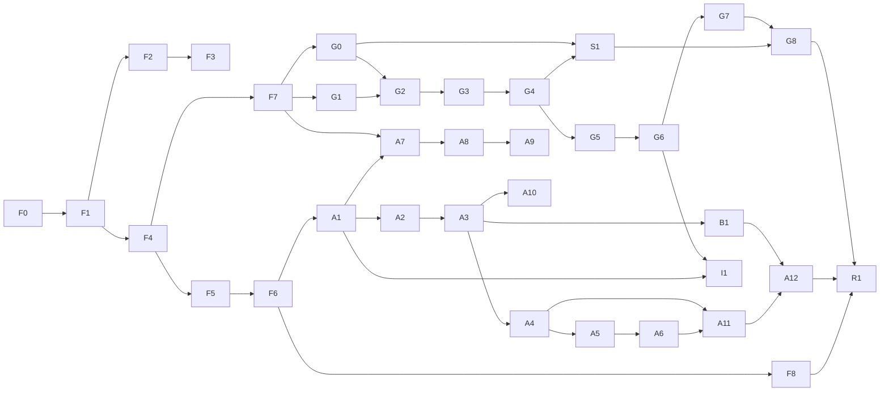

# Workplan maestro de integración

Este archivo convierte los planes de Foundation, Animoto y Grid Splitter en un frontier ejecutable. La regla es vertical-slice-first con contratos centrales antes de paralelizar.

## Frontier actual

**Wave 0 (F0+B0), F1, F2, F3-01..F3-06, F4-01..F4-06 y F5-01..F5-02 aceptados. Frontiers: F3-07 pendiente de browser; F5-03/F5-04/F5-05 autorizados.**

No está autorizado iniciar componentes de Animoto/Grid, copiar stores, trasladar el worker ni añadir dependencias de export. W0 ya congeló contrato, baseline y manifest golden fuente; F1 amplía el command kernel por familias independientes. El estado actual de `package.json` pertenece al usuario y debe preservarse; cualquier reconciliación de dependencias empieza con diff/ownership explícito.

F4 avanza en paralelo porque su contrato depende de F1-08, ya aceptado. Esto no
degrada F3-07: su harness queda `ready-for-browser`, pero el gate continúa
abierto hasta ejecutar J1/J8 en el perfil Chrome real y revisar el artefacto.
F4-04/F4-05 cerraron history, selectors y el primer batch `timeline-layout`:
provider local y migración exclusiva de `WorkspaceStore.panelSizes.timeline`
desde `AppLayout` a un leaf consumer. `ProjectContext` y el documento legacy
quedaron fuera. F4-06 cerró batch undo/redo, frontera data-only contra mutación
o código externo, retención configurable (100 por defecto) y el gate conjunto
de stores. W1 global continúa abierto únicamente por el browser gate F3-07.
F5-01 añadió la proyección canónica data-only desde ProjectStore y el viewport
activo de WorkspaceStore. La raíz se resuelve por workspace, selección durable
y orden documental; asset, region, composition, variant y cel quedan
normalizados e inmutables sin introducir Canvas, URLs, playback ni decisiones
de rasterización. F5-02 puede implementar el compositor sobre este único input.
F5-02 cerró ese compositor: compila matrices/painter order a un plan inmutable,
resuelve cada asset una vez antes de abrir el frame y ejecuta por un target con
rollback obligatorio. Asset, region, composition/layer, variant y cel comparten
los mismos pixels; Canvas2D preserva estado externo y nearest es el default.
Scheduler, thumbnail y export adapters pueden avanzar sobre esta única salida.

## Reglas de ejecución

1. Un slice tiene una superficie writable exclusiva. Si necesita tocar otra, se actualiza este plan antes de editar.
2. Cada slice entrega comportamiento visible o un contrato ejecutable; no se abren refactors horizontales sin consumidor inmediato.
3. Los adapters legacy son temporales y llevan owner/removal gate. Nunca se convierten en la API nueva.
4. Los cambios se mantienen detrás de feature flags hasta pasar su journey E2E y migration/recovery gate.
5. Los trabajos `[gpt-5.6-luna | max]` son mecánicos/acotados y quedan `needs-review`; Sol/xhigh revisa diff, tests, evidencia y scope antes de integrarlos.
6. Fallar un gate bloquea dependientes. No se compensa con comentarios, screenshots parciales o “funciona en mi sesión”.
7. Cada PR/slice actualiza su fila, la matriz de paridad correspondiente y el ledger de evidencia de `QUALITY_GATES.md`.

## Dependencias



`I1` es el gate de integración Grid → Compose. A1 puede desarrollarse con assets simples después de F1-F6; W4 no cierra hasta que I1 pruebe el handoff con outputs G6 reales.

## Wave 0 — Congelar contratos y baseline

| ID | Owner | Dependencias | Writable | Entregable | Gate/retorno |
|---|---|---|---|---|---|
| F0 | [gpt-5.6-sol \| xhigh] | — | ADR, types de contrato, `tests/contract/**` | Vocabulario, invariantes, fixture legacy actual y tests inicialmente rojos | ADR aceptada; `done` o `needs-review` si una entidad sigue ambigua |
| B0 | [gpt-5.6-luna \| max] | F0 | scripts de inventario/test metadata | Snapshot reproducible de LOC, bundle, coverage, browser journeys y fixture manifests | `needs-review`; Sol valida comandos/salidas, sin editar producto |

Gate W0:

- `StudioProjectV1` y la policy de identity/reference/orphans están decididos.
- Existe al menos un fixture legacy real sanitizado y un manifest Grid golden.
- Baseline separa fallos previos de regresiones nuevas.

## Wave 1 — ProjectEngine y persistencia

| ID | Owner | Dependencias | Writable | Entregable | Gate/retorno |
|---|---|---|---|---|---|
| F1 | [gpt-5.6-sol \| xhigh] + [gpt-5.6-luna \| max] acotado | F0 | `core/project/**` | Schema validado, commands, impact analysis, inverses y graph invariants | Property/round-trip tests verdes; Luna queda `needs-review` |
| F2 | [gpt-5.6-sol \| xhigh] + [gpt-5.6-luna \| max] adapter | F1 | `core/assets/**`, adapter `utils/db.ts` | AssetRepository, hashes, URL lifecycle, integrity/quota errors | Browser reload/cleanup verde; `needs-review` si tocó storage adapter |
| F3 | [gpt-5.6-sol \| xhigh] | F1-F2 | `core/persistence/**`, migration fixtures | Codec, step migrations, autosave journal y `.spriteboy` package | Legacy/recovery/portable journey verde; `done` |
| F4 | [gpt-5.6-sol \| xhigh] + [gpt-5.6-luna \| max] por consumer batch | F1 | stores/selectors y consumidores declarados | Durable/ephemeral split e history transactions | Render-count + drag/batch undo; batches `needs-review` |

Gate W1:

- Save-close-reload y export/import funcionan con blobs reales.
- Delete/reorder/reslice nunca usa índices como identidad.
- Un proyecto malformed/future/corrupt falla con recovery report sin reemplazar el activo.
- Interaction/Job/Playback state no ensucia proyecto ni history.

## Wave 2 — Render, shell, jobs y CI

| ID | Owner | Dependencias | Writable | Entregable | Gate/retorno |
|---|---|---|---|---|---|
| F5 | [gpt-5.6-sol \| xhigh] | F1,F4 | `core/render/**`, canvas adapters | Scene projection, compositor e invalidation scheduler | 0 rAF idle + visual baseline; `done` |
| F6 | [gpt-5.6-sol \| xhigh] | F4-F5 | `components/studio/**`, header/layout/palette | Workspace/command registry y panel contracts | 5 workspaces alcanzables, keyboard/compact layout; `done` |
| F7 | [gpt-5.6-sol \| xhigh] | F1,F4 | `core/processing/**`, `core/export/**`, Job Center | Job lifecycle, ExportPort/format registry, cancel/retry/timeout y errors tipados | Failure injection sin late writes/leaks; `done` |
| F8 | [gpt-5.6-sol \| xhigh] strategy + [gpt-5.6-luna \| max] config | F0-F7 | CI/config/scripts/tests | Lock reproducible, lint warnings cero, test/build/E2E/budgets | CI failure injection + Sol audit; `needs-review` hasta aprobar |

Gate W2:

- Collision, Slice, Compose y Animate son entradas reales aunque algunas muestren empty state.
- Open/Analyze y todo command visible tiene handler o está oculto tras flag, nunca placeholder.
- Canvas preview/thumbnails/export dependen del mismo compositor.
- CI puede bloquear type/lint/unit/integration/E2E/build/budget.

## Wave 3 — Grid Splitter dentro de Slice

| ID | Owner | Dependencias | Writable | Entregable | Gate/retorno |
|---|---|---|---|---|---|
| G0 | [gpt-5.6-sol \| xhigh] + [gpt-5.6-luna \| max] UI | F2,F5-F7 | Slice source session/drop/Asset adapters | Pick/drop/validate/decode/preview/metadata/replace/reset | G1.1-G1.6 + URL/job cleanup; `needs-review` |
| G1 | [gpt-5.6-sol \| xhigh] | F2,F7 | processing adapter, worker, golden tests | requestId/progress/cancel/crash/timeout y baseline algorítmico | Concurrent/cancel/crash tests; `done` |
| G2 | [gpt-5.6-sol \| xhigh] + [gpt-5.6-luna \| max] UI | G0-G1,F5,F6 | Slice Grid section/worker stage | Auto/manual rows/cols, overlay y detected feedback | Geometry/golden/UI evidence; `needs-review` |
| G3 | [gpt-5.6-sol \| xhigh] | G2 | Crop section/stage | Threshold/padding/reduction | Edge fixtures sin OOB; `done` |
| G4 | [gpt-5.6-sol \| xhigh] | G1,G3,F5 | Chroma section/stage/eyedropper | Color/tolerance/smoothness/spill + chroma→crop | Visual goldens + DPR pick + a11y; `done` |
| G5 | [gpt-5.6-sol \| xhigh] + [gpt-5.6-luna \| max] presets UI | G3-G4 | Pixel/palette section/stages | Resize, quantization count, auto/fixed palettes | Determinism/perf/palette membership; `needs-review` |
| G6 | [gpt-5.6-sol \| xhigh] | G2-G5,F1-F3 | results tray, region/asset commands | Staged results y commit atómico como Regions/Assets | Process-save-reload-undo; `done` |
| G7 | [gpt-5.6-luna \| max] + [gpt-5.6-sol \| xhigh] review | G6,F7 | result/ExportPort actions | Download one/all, manifest y handoff a Compose/Animate | Artifact validation; `needs-review` |
| S1 | [gpt-5.6-sol \| xhigh] | F1-F7,G0,G3-G4 | irregular region tools/processing adapters | Connected-components, wand, manual region edit, to-asset y margins/gaps H4 | J2 irregular + undo/save/export; `done` |
| G8 | [gpt-5.6-sol \| xhigh] | G0-G7,S1 | Slice boundary, obsolete slicer code/docs | A11y/resilience; path legacy queda fallback-only para soak | Matrices G/H4 completas, no console/leaks; `done` |

Gate W3:

- Fixture 3x3 completa el journey Grid de punta a punta dentro de SpriteBoy.
- File picker/drop/validation/preview/replace/reset pertenecen al source session G0, no a results/hardening implícitos.
- El worker real se ejecuta en tests, no sólo helpers.
- Recipe y resultados sobreviven reload; outputs committed entran en Asset Library/Compose sin reimportar.
- Algoritmos legacy equivalentes quedan retirados o delegan al port canónico.
- H4.1-H4.8 demuestran que el slicing irregular/manual actual no se redujo a grids.

## Wave 4 — Compose y timeline base

| ID | Owner | Dependencias | Writable | Entregable | Gate/retorno |
|---|---|---|---|---|---|
| A1 | [gpt-5.6-sol \| xhigh] | F1-F6 | Compose bootstrap/Project menu adapters | Primera composición desde asset/region, save/reload | Portable journey; `done` |
| A2 | [gpt-5.6-luna \| max] + [gpt-5.6-sol \| xhigh] review | A1 | layers panel/commands | Add/remove/duplicate/sync/reorder/visibility/opacity | DnD/undo/reload; `needs-review` |
| A3 | [gpt-5.6-sol \| xhigh] | A2,F5 | Compose canvas/overlays/interaction | Gizmo, numeric transform, selection y snap guides | Pointer/keyboard/DPR/render trace; `done` |
| A4 | [gpt-5.6-sol \| xhigh] | A2-A3 | variants/compositor cache | A/B/C/D y active variant | Reload/export visual match; `done` |
| A5 | [gpt-5.6-sol \| xhigh] + [gpt-5.6-luna \| max] controls | A1,A4,F4,F6 | Animate timeline | Add/delete/duplicate/reorder/swap/multi-select/prompts/locks + upload user keyframe | Identity stress + DnD/keyframe import; `needs-review` |
| B1 | [gpt-5.6-sol \| xhigh] + [gpt-5.6-luna \| max] controls | A1-A3,F1-F6 | Compose Builder superset | Grid/free, slots, fit/alignment/full transforms, free objects y geometry H3 | Builder migration + J3 goldens; `needs-review` |
| I1 | [gpt-5.6-sol \| xhigh] | G6,A1 | Slice/Compose handoff adapters only | Committed Region/Asset abre composición/secuencia sin reimport/store switch | J2→J3 round-trip; `done` |

Gate W4:

- I1 demuestra que un resultado Grid se convierte en composición/secuencia sin cambiar de aplicación o store.
- Todos los layer/cel edits tienen undo/save/reload y usan IDs estables.
- Canvas, thumbnail y export projection muestran el mismo resultado.
- H3.1-H3.10 preservan Builder grid/free, slot/free-object y transform semantics.

## Wave 5 — Playback, AI y edición avanzada

| ID | Owner | Dependencias | Writable | Entregable | Gate/retorno |
|---|---|---|---|---|---|
| A6 | [gpt-5.6-sol \| xhigh] | A5,F5 | playback/onion overlays | FPS, play/scrub, loop/pin y onion skin | Timing/hidden-tab/idle/export isolation; `done` |
| A7 | [gpt-5.6-sol \| xhigh] | A1,A4-A6,F7 | `core/ai/**`, generation inspector | Provider port, donor prompt/plan + host H2 modes/model/context/analyze | Fake provider + redaction/cost/cancel; `done` |
| A8 | [gpt-5.6-sol \| xhigh] | A7 | generation job graph | Sequential/recursive, locks/pin, audit y atomic accept | Count/edge/failure matrix; `done` |
| A9 | [gpt-5.6-sol \| xhigh] | A8 | generation/correction flows | Regenerate, fill missing y correct selection | Neighbor/lock/partial failure/undo; `done` |
| A10 | [gpt-5.6-sol \| xhigh] | A3-A5 | alignment tool/compositor | Pan/zoom/reset/reference/apply | ADR + cancel/apply/undo/export match; `done` |

Gate W5:

- Provider failures, cancel y retries no producen writes tardíos o cobros/estados ambiguos.
- Generation nunca sobrescribe una variante/locked cel sin draft + accept explícito.
- Corrección y alignment mantienen provenance y round-trip durable.

## Wave 6 — Export, accesibilidad y cuarentena legacy

| ID | Owner | Dependencias | Writable | Entregable | Gate/retorno |
|---|---|---|---|---|---|
| A11 | [gpt-5.6-sol \| xhigh] codecs + [gpt-5.6-luna \| max] UI | A4,A6,F7,G7 | Export Center/workers | Superset H1.1-H1.6 + Animoto ZIP/GIF/MP4/WebM con progress/cancel | Decode/contracts/browser matrix; `needs-review` |
| A12 | [gpt-5.6-sol \| xhigh] | A1-A11,B1 | shared primitives, legacy adapters/docs | Shortcuts, sound, responsive/a11y, H6 preferences y retiro de shell/store donante | Matrices A/H6 completas, no warnings; `done` |
| C1 | [gpt-5.6-sol \| xhigh] | F1,F5,F6,A5 | Collision feature | Owner estable region/composition/cel, H5.6-H5.7 y UI alcanzable | Create/edit/tag/save/export/undo/E2E; `done` |
| X1 | [gpt-5.6-sol \| xhigh] | G8,A12,C1 | legacy host slicer/controller/persistence | Canonical default; legacy aislado, read-only y desactivado detrás de rollback flag | No consumidores mezclados; fallback smoke + docs; `done` |

Gate W6:

- Paridad Animoto y Grid completa y documentada.
- Los 47 behaviors H1-H6 del Studio actual tienen evidencia canónica.
- Collision deja de ser feature declarada pero inalcanzable.
- No queda segundo state engine, persistence path, renderer o processing implementation activo; el fallback legacy permanece aislado sólo para el soak.
- Bundle/performance/a11y/security gates pasan.

## Wave 7 — Release y migración

| ID | Owner | Dependencias | Writable | Entregable | Gate/retorno |
|---|---|---|---|---|---|
| R1 | [gpt-5.6-sol \| xhigh] | F8,G8,A12,C1,X1 | migration/release docs, flags/telemetry local | Release candidate con flags y migration report | Full gate manifest; `done` o blocker explícito |
| R2 | [gpt-5.6-sol \| xhigh] | R1 soak | cleanup/flags/legacy files | Retiro físico del fallback y flags después del soak; canonical queda único | No severe issues + backup/recovery probado; `done` |

### Estrategia de rollout

1. `studioProjectEngine` flag habilita schema/store/codec para fixtures y proyectos nuevos internos.
2. `advancedSlice` habilita G0-G8 sobre el engine nuevo.
3. `compositionEditor` habilita A1-A6.
4. `aiAnimation` y `multiFormatExport` habilitan A7-A11 sólo con sus ports/gates.
5. Un migration preview muestra backup, versión destino, assets faltantes y cambios antes de confirmar.
6. La primera escritura canonical conserva un backup exportable del legacy. Rollback abre el backup; no intenta des-migrar in-place.
7. Antes del soak, X1 vuelve canonical el default y aísla el legacy detrás del rollback flag.
8. Después del soak, R2 elimina físicamente fallback/adapters sólo cuando fixtures/métricas confirman que ya no son necesarios.

No se envía telemetría externa por defecto. El debug report local incluye versión, command/error codes, timing y counts, nunca API keys, prompts o contenido de imagen salvo opt-in explícito.

## Paralelización permitida

Después de W2:

- El stream Grid `G0 + G1` puede avanzar en paralelo con el stream Compose `A1 → A2`; G0/G1 tienen ownership separado y G2 espera que ambos contratos estén congelados.
- Golden fixtures/Grid worker y shared Studio primitives pueden avanzar en paralelo con owners distintos; ninguna UI consume payloads G1 inestables.
- A7 AI port puede diseñarse mientras A5/A6 se implementan, pero no integrar generation jobs hasta tener cels/variants/playback estables.
- A11 codec/export research puede preparar contract tests temprano; la implementación espera al compositor A4/A6.

No paralelizar:

- Migrations y schema changes concurrentes.
- Store split y consumer migration sin una lista de ownership por lote.
- RenderEngine y un segundo compositor de feature.
- Worker protocol y UI que dependa de payloads aún inestables.

## Rutina por slice

1. Releer este frontier y el plan propietario.
2. Registrar baseline y tests de aceptación rojos.
3. Implementar el menor vertical slice que cierre el behavior ID.
4. Ejecutar checks focalizados y luego gates de repositorio proporcionados al riesgo.
5. Capturar screenshot/video/trace/artifact cuando corresponda.
6. Auditar hostile paths y cleanup.
7. Actualizar matriz, evidence ledger, docs afectadas y estado del slice.
8. Entregar `done`, `needs-review` o blocker exacto; nunca “casi terminado”.

## Comandos base esperados

Mientras los scripts no cambien:

```powershell
bun run typecheck
bun run lint
bun run test
bun run build
```

F8 debe agregar comandos estables para coverage, integration, E2E, accessibility y budgets. El lockfile debe dejar de estar ignorado y la CI debe instalar de forma reproducible, pero esa modificación requiere primero reconciliar el `package.json` actualmente modificado por el usuario.
