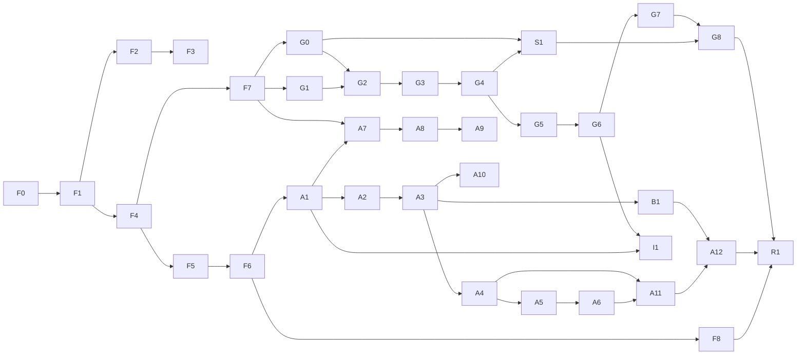

# Workplan maestro de integración

Este archivo convierte los planes de Foundation, Animoto y Grid Splitter en un frontier ejecutable. La regla es vertical-slice-first con contratos centrales antes de paralelizar.

## Frontier actual

**Wave 0 (F0+B0), F1, F2, F3-01..F3-06, F4-01..F4-06, F5-01..F5-06, F6-01..F6-06, F7-01..F7-07, F8-01..F8-02 y F8-04 aceptados. Frontiers: F3-07 pendiente de browser; F8-03 condicionado por ownership de package/lock; F8-05 activo.**

No está autorizado iniciar componentes de Animoto/Grid, copiar stores, trasladar el worker ni añadir dependencias de export. W0 ya congeló contrato, baseline y manifest golden fuente; F1 amplía el command kernel por familias independientes. El estado actual de `package.json` pertenece al usuario y debe preservarse; cualquier reconciliación de dependencias empieza con diff/ownership explícito.

F4 avanza en paralelo porque su contrato depende de F1-08, ya aceptado. Esto no
degrada F3-07: su harness queda `ready-for-browser`, pero el gate continúa
abierto hasta ejecutar J1/J8 en el perfil Chrome real y revisar el artefacto.
F4-04/F4-05 cerraron history, selectors y el primer batch `timeline-layout`:
provider local y migración exclusiva de `WorkspaceStore.panelSizes.timeline`
desde `AppLayout` a un leaf consumer. `ProjectContext` y el documento legacy
quedaron fuera. F4-06 cerró batch undo/redo, frontera data-only contra mutación
o código externo, retención configurable (100 por defecto) y el gate conjunto
de stores. W1 global continúa abierto únicamente por el browser gate F3-07.
F5-01 añadió la proyección canónica data-only desde ProjectStore y el viewport
activo de WorkspaceStore. La raíz se resuelve por workspace, selección durable
y orden documental; asset, region, composition, variant y cel quedan
normalizados e inmutables sin introducir Canvas, URLs, playback ni decisiones
de rasterización. F5-02 puede implementar el compositor sobre este único input.
F5-02 cerró ese compositor: compila matrices/painter order a un plan inmutable,
resuelve cada asset una vez antes de abrir el frame y ejecuta por un target con
rollback obligatorio. Asset, region, composition/layer, variant y cel comparten
los mismos pixels; Canvas2D preserva estado externo y nearest es el default.
Scheduler, thumbnail y export adapters pueden avanzar sobre esta única salida.
F5-03 cerró el scheduler por invalidación: coalesce reasons/revision/changed IDs,
serializa renders async y sólo mantiene continuidad mediante leases de drag o
playback. El host queda en cero callbacks al entrar en idle; dispose y fallos no
reactivan trabajo tardío. Los boundaries reentrantes del host están probados,
incluidos throw + observer que reinvalida y release/dispose antes de recibir el
handle solicitado.
F5-04 añadió thumbnails bounded sin reinterpretar la escena: aspect-fit sin
crop/padding, no-upscale por defecto y un único surface final de hasta 2048 por
eje. Software goldens prueban los cinco roots; Browser Canvas2D/OffscreenCanvas
usa las mismas matrices y cleanup obligatorio. PNG/WebP conserva MIME exacto,
incluido Blob cross-realm, sin aceptar objetos que falsifiquen la marca Blob.
F5-05 cerró el raster master de escena: PNG/WebP full-resolution con límites
pre-allocation, metadata tipada, MIME exacto y cleanup total sobre OffscreenCanvas
o HTMLCanvas. Export y thumbnail capturan un único draw plan antes de crear la
surface, por lo que un boundary reentrante no puede desacoplar dimensiones,
revision y pixels. ZIP/GIF/video, URLs, download, hashing y jobs siguen en F7/A11.
F5-06 cerró el viewport browser: content-box + DPR producen backing pixels
exactos; DPR y workspace viewport forman una única base matrix; scheduler queda
en cero rAF idle. Context loss suspende sin perder dirty/leases y restore redraws
una vez. Generations async superseded no bloquean el frame fresco; dispose corta
observer/listeners/rAF/completions y libera el backing a 0x0. Chrome real DPR 2
probó resize, pixel sample, idle, restore y cleanup sin errores.
F6-01 congeló los cinco destinos navegables Slice/Compose/Animate/Collision/
Export con hrefs hash, command IDs, orden y capacidades tipadas. `assets` sigue
siendo contexto canónico de selección/render y Asset Library compartida, no un
sexto destino. La partición compile/runtime cubre todo `WorkspaceId`; reducer,
validator y WorkspaceStore consumen una única lista canónica.
F6-02 registró 15 comandos de shell data-only y profundamente inmutables. Un
port obligatorio capturado ejecuta cada ID; estados disabled tipados bloquean
sin llamar handlers y los failures se propagan. Atajos por `KeyboardEvent.code`
usan modificador `primary`, policy editable y auditoría de IDs/conflictos. Open
y Analyze legacy vacíos no forman parte del registry.
F6-03 reemplazó el header de tres modos por un shell derivado de los registries:
cinco destinos visibles, URL hash canónica, back/forward/reload y command palette
ejecutable comparten IDs. El `AppMode` legacy es sólo una proyección one-way y
no se creó un segundo ProjectStore. Open/Import usan inputs reales y el timeline
se decide por capabilities. Chrome real cubrió cinco tabs, navegación, recarga y
palette sin errores; F6-04 queda a cargo de foco, modales y ruta compacta.
F6-04 unificó overlays y paneles: `StudioDialog` posee foco inicial, trap,
Escape/backdrop, restore y reduced motion; `StudioPanel` presenta los mismos
consumers como sidebars desktop o drawers compactos sin duplicarlos. Header y
layout comparten breakpoint `xl`, así que los cinco workspaces y Tools/
Properties siguen alcanzables a 1024x768. Los seis overlays legacy migraron al
contrato, incluidos dos repairs de hook order. Chrome productivo probó 1440x900
y 1024x768 sin overflow, errores ni excepciones. F6-05 puede añadir estados por
workspace sobre estas superficies.
F6-05 reemplazó el empty genérico de Builder por un resolver exhaustivo de
Slice/Compose/Animate/Collision/Export. Loading viene del UI controller, los
fallos de command quedan locales y reintentables, y ready se deriva sólo de
source/canvas/frames existentes; no apareció otro store. Las acciones usan IDs
ejecutables del registry y CanvasArea sólo monta cuando el destino está ready.
Chrome productivo recorrió las cinco rutas, transición empty→ready y recovery
Compose→Slice con transferencia de foco al contenido nuevo. También expuso y
cerró rejections `AbortError` de view transitions rápidas; el gate final quedó
sin overflow, console errors ni excepciones. F6-06 puede consolidar shortcuts y
retirar rutas/commands legacy inalcanzables.
F6-06 cerró W2/J9 con una única ruta keyboard: el registry resuelve `code`,
Ctrl/Cmd, modificadores exactos y editable policy; el hook global ejecuta IDs
canónicos antes de delegar arrows/Delete/playback a sus dominios. Space-pan sólo
opera con foco en workspace, nunca roba textarea ni playback y blur limpia todo
estado transitorio. Se retiraron Header y command array legacy —incluidos Open/
Analyze inertes—, Help se deriva del registry y Snapshot abre Export real.
Chrome probó Ctrl+1..5, guards modal/editable, Help/Palette/Preferences, Reset
Canvas y Snapshot con foco correcto y cero errores. La revisión detectó y cerró
un stuck-pan al perder foco.
F7-01 congeló un lifecycle puro desde `queued` hacia `running` y los terminales
`succeeded`, `failed`, `cancelled` o `timed-out`, con progreso global monotónico, errores estructurados y eventos
ligados a request. Retry crea un nuevo job/request con root/previous/attempt y
nunca reescribe el terminal. El JobStore valida el state machine y conserva
tombstones efímeros de job/request y sources consumidos: remove/reset no pueden
reabrir un parent ni reciclar una identidad para capturar respuestas tardías.
Cuatro rondas adversariales cerraron linajes falsos, terminales imposibles y
reuso tras remove/reset; F7-02 puede montar runner/abort sobre este contrato.
F7-02 añadió un único `JobRunner` genérico sobre lifecycle y JobStore. Reserva
la identidad antes de publicar, arranca una tarea con AbortController propio y
es el único owner de progress, success, failure, cancel y timeout. Cancelación,
caller abort, dispose y timeouts suprimen cualquier completion tardía, limpian
timer/listener/active map y nunca permiten que un terminal pierda una carrera.
El runner vuelve a tomar el snapshot canónico clonado por JobStore después del
publish, por lo que mutar el input del caller no cambia IDs, timeout ni estado.
Timeouts mayores al máximo nativo se programan por tramos sin overflow; errores
tipados adulterados degradan a un fallo seguro. La revisión independiente cerró
cinco rondas de races/hostile input y aceptó 42/42 focales; F7-03 puede construir
retención/selectores de Job Center sin migrar todavía workers concretos.
F7-03 mantuvo JobStore como único owner y añadió retención visible por familias
de retry completas: active/queued pinnean toda su ancestry y sólo familias
terminales antiguas se podan atómicamente. Job/request tombstones y retry
sources consumidos siguen vivos toda la sesión. Los selectors memoizados
presentan active-first, resumen por status y retries realmente accionables; no
cuentan parents que ya consumieron su único child. La revisión también cerró
una carrera cross-job: cancel, caller abort, dispose y timeout solicitados desde
un subscriber se difieren hasta salir del publish sin perder first-terminal,
mientras progress reentrante devuelve false sin dejar un running huérfano.
F7-04 montó un único Job Center global en el shell: trigger con badge
active/total, drawer desktop/compact, progress semántico, estados live por
job/attempt y resumen de historial. Cancel usa el JobRunner compartido; retry
sólo aparece cuando existe un adapter real y el source sigue accionable. Throws
síncronos/async del adapter quedan contenidos y redactados. El provider dispone
sólo runners propios y conserva runners inyectados. Chrome productivo probó
1440x900 y 1024x768, foco atrapado/restaurado, Escape/cierre, page-fit y cero
errores/excepciones. F7-05 puede congelar contratos de export sin migrar todavía
los adapters concretos.
F7-05 congeló `ExportPort`, un registry que sólo lista providers ejecutables y
un writer de destino verificable. Request/artifact/project/revision se capturan
antes del boundary async; descriptor, MIME, extensión, filename portable, Blob
nativo, byte budget y receipt exacto se validan antes de publicar éxito. El
port no conoce DOM, object URLs, stores ni downloads. Registry/list/provider
drift, IDs ocultos, getters/mutaciones hostiles y errores spoofed quedan
contenidos; AbortSignal usa slots/listeners nativos. La revisión aceptó 20/20 y
el gate F7 acumulado 62/62. F7-06 inyectó quota, provider/worker crash,
timeout y cancel races sobre JobRunner + ExportPort. La Promise real del port
rechaza abort, nunca publica un receipt tardío y el snapshot completo de
JobStore conserva identidad después de cada late settlement. Timers y listeners
cierran con cardinalidad exacta; un writer cooperativo no completa side effects
después de abort. La revisión aceptó 6/6 focales y 68/68 acumulados. F7-07 puede
congelar el gate y la traducción diagnóstica sin migrar todavía codecs reales.
F7-07 cerró W2 con un único adapter Job↔Export en processing. El request ID y
AbortSignal vienen sólo del contexto canónico; once códigos branded se traducen
a diagnostics seguros y exhaustivos. Quota nativa queda actionable como
`quota-exceeded`; errors unknown/spoofed se redactan. Cancel/timeout siguen
siendo terminales autoritativos aunque el port rechace después. El security
review reprodujo y cerró una fuga de registry por errores externos prototype/
branded. El gate pasó 74/74 acumulados F7, 42 archivos/461 contract tests,
61 archivos/579 tests completos, typecheck, lint estricto y build. F8-01 puede reconciliar reproducibilidad sin
asumir ownership del `package.json` modificado por el usuario.
F8-01 confirmó que `package.json` conserva doce upgrades user-owned mientras
`bun.lock` está ignorado y su workspace root aún coincide con HEAD. No hay otro
lock ni workflows CI, y package no declara manager/engines. El record aprobado
prohíbe tocar/stagear/regenerar package+lock; F8-02 puede crear comandos directos
tracked. F8-03 no podrá declarar frozen install hasta una decisión explícita del
owner y reconciliación conjunta de manifest+lock.
F8-02 añadió un manifest ejecutable de ocho gates sin aliases ni shell strings:
typecheck, lint con ratchet inclusivo de 47 warnings, unit, contract,
integration, build, e2e y all. El smoke e2e sirve el build de producción y usa
Chrome/CDP con perfil efímero, timeouts por comando, cleanup propio y
diagnósticos redactados; exige ruta Slice visible, page-fit y cero errores de
console/runtime/log/HTTP/red. La revisión cerró ratchet, desconexión CDP,
observabilidad de red y flags duplicados. F8-04 puede fijar coverage y retención
de fixtures sin modificar el package user-owned.
F8-04 mide las 54 fuentes runtime canónicas bajo `core/**` —incluidas 13 de
`core/project`— con el corpus completo. El ratchet actual queda en 82.29%
statements, 76.75% branches, 91.72% functions y 86.15% lines; el target release
90/85/90/90 permanece rojo y bloquea F8-06 hasta mejorar tests/código. Un
manifest exhaustivo retiene siete fixtures/goldens tracked bajo dos roots con
identidad SHA-256/bytes cross-platform, prohibición de symlinks y detección de
missing/unmanifested/drift. F8-05 puede automatizar budgets y retirar warnings.

## Reglas de ejecución

1. Un slice tiene una superficie writable exclusiva. Si necesita tocar otra, se actualiza este plan antes de editar.
2. Cada slice entrega comportamiento visible o un contrato ejecutable; no se abren refactors horizontales sin consumidor inmediato.
3. Los adapters legacy son temporales y llevan owner/removal gate. Nunca se convierten en la API nueva.
4. Los cambios se mantienen detrás de feature flags hasta pasar su journey E2E y migration/recovery gate.
5. Los trabajos `[gpt-5.6-luna | max]` son mecánicos/acotados y quedan `needs-review`; Sol/xhigh revisa diff, tests, evidencia y scope antes de integrarlos.
6. Fallar un gate bloquea dependientes. No se compensa con comentarios, screenshots parciales o “funciona en mi sesión”.
7. Cada PR/slice actualiza su fila, la matriz de paridad correspondiente y el ledger de evidencia de `QUALITY_GATES.md`.

## Dependencias



`I1` es el gate de integración Grid → Compose. A1 puede desarrollarse con assets simples después de F1-F6; W4 no cierra hasta que I1 pruebe el handoff con outputs G6 reales.

## Wave 0 — Congelar contratos y baseline

| ID | Owner | Dependencias | Writable | Entregable | Gate/retorno |
|---|---|---|---|---|---|
| F0 | [gpt-5.6-sol \| xhigh] | — | ADR, types de contrato, `tests/contract/**` | Vocabulario, invariantes, fixture legacy actual y tests inicialmente rojos | ADR aceptada; `done` o `needs-review` si una entidad sigue ambigua |
| B0 | [gpt-5.6-luna \| max] | F0 | scripts de inventario/test metadata | Snapshot reproducible de LOC, bundle, coverage, browser journeys y fixture manifests | `needs-review`; Sol valida comandos/salidas, sin editar producto |

Gate W0:

- `StudioProjectV1` y la policy de identity/reference/orphans están decididos.
- Existe al menos un fixture legacy real sanitizado y un manifest Grid golden.
- Baseline separa fallos previos de regresiones nuevas.

## Wave 1 — ProjectEngine y persistencia

| ID | Owner | Dependencias | Writable | Entregable | Gate/retorno |
|---|---|---|---|---|---|
| F1 | [gpt-5.6-sol \| xhigh] + [gpt-5.6-luna \| max] acotado | F0 | `core/project/**` | Schema validado, commands, impact analysis, inverses y graph invariants | Property/round-trip tests verdes; Luna queda `needs-review` |
| F2 | [gpt-5.6-sol \| xhigh] + [gpt-5.6-luna \| max] adapter | F1 | `core/assets/**`, adapter `utils/db.ts` | AssetRepository, hashes, URL lifecycle, integrity/quota errors | Browser reload/cleanup verde; `needs-review` si tocó storage adapter |
| F3 | [gpt-5.6-sol \| xhigh] | F1-F2 | `core/persistence/**`, migration fixtures | Codec, step migrations, autosave journal y `.spriteboy` package | Legacy/recovery/portable journey verde; `done` |
| F4 | [gpt-5.6-sol \| xhigh] + [gpt-5.6-luna \| max] por consumer batch | F1 | stores/selectors y consumidores declarados | Durable/ephemeral split e history transactions | Render-count + drag/batch undo; batches `needs-review` |

Gate W1:

- Save-close-reload y export/import funcionan con blobs reales.
- Delete/reorder/reslice nunca usa índices como identidad.
- Un proyecto malformed/future/corrupt falla con recovery report sin reemplazar el activo.
- Interaction/Job/Playback state no ensucia proyecto ni history.

## Wave 2 — Render, shell, jobs y CI

| ID | Owner | Dependencias | Writable | Entregable | Gate/retorno |
|---|---|---|---|---|---|
| F5 | [gpt-5.6-sol \| xhigh] | F1,F4 | `core/render/**`, canvas adapters | Scene projection, compositor e invalidation scheduler | 0 rAF idle + visual baseline; `done` |
| F6 | [gpt-5.6-sol \| xhigh] | F4-F5 | `components/studio/**`, header/layout/palette | Workspace/command registry y panel contracts | 5 workspaces alcanzables, keyboard/compact layout; `done` |
| F7 | [gpt-5.6-sol \| xhigh] | F1,F4 | `core/processing/**`, `core/export/**`, Job Center | Job lifecycle, ExportPort/format registry, cancel/retry/timeout y errors tipados | Failure injection sin late writes/leaks; `done` |
| F8 | [gpt-5.6-sol \| xhigh] strategy + [gpt-5.6-luna \| max] config | F0-F7 | CI/config/scripts/tests | Lock reproducible, lint warnings cero, test/build/E2E/budgets | CI failure injection + Sol audit; `needs-review` hasta aprobar |

Gate W2:

- Collision, Slice, Compose y Animate son entradas reales aunque algunas muestren empty state.
- Open/Analyze y todo command visible tiene handler o está oculto tras flag, nunca placeholder.
- Canvas preview/thumbnails/export dependen del mismo compositor.
- CI puede bloquear type/lint/unit/integration/E2E/build/budget.

## Wave 3 — Grid Splitter dentro de Slice

| ID | Owner | Dependencias | Writable | Entregable | Gate/retorno |
|---|---|---|---|---|---|
| G0 | [gpt-5.6-sol \| xhigh] + [gpt-5.6-luna \| max] UI | F2,F5-F7 | Slice source session/drop/Asset adapters | Pick/drop/validate/decode/preview/metadata/replace/reset | G1.1-G1.6 + URL/job cleanup; `needs-review` |
| G1 | [gpt-5.6-sol \| xhigh] | F2,F7 | processing adapter, worker, golden tests | requestId/progress/cancel/crash/timeout y baseline algorítmico | Concurrent/cancel/crash tests; `done` |
| G2 | [gpt-5.6-sol \| xhigh] + [gpt-5.6-luna \| max] UI | G0-G1,F5,F6 | Slice Grid section/worker stage | Auto/manual rows/cols, overlay y detected feedback | Geometry/golden/UI evidence; `needs-review` |
| G3 | [gpt-5.6-sol \| xhigh] | G2 | Crop section/stage | Threshold/padding/reduction | Edge fixtures sin OOB; `done` |
| G4 | [gpt-5.6-sol \| xhigh] | G1,G3,F5 | Chroma section/stage/eyedropper | Color/tolerance/smoothness/spill + chroma→crop | Visual goldens + DPR pick + a11y; `done` |
| G5 | [gpt-5.6-sol \| xhigh] + [gpt-5.6-luna \| max] presets UI | G3-G4 | Pixel/palette section/stages | Resize, quantization count, auto/fixed palettes | Determinism/perf/palette membership; `needs-review` |
| G6 | [gpt-5.6-sol \| xhigh] | G2-G5,F1-F3 | results tray, region/asset commands | Staged results y commit atómico como Regions/Assets | Process-save-reload-undo; `done` |
| G7 | [gpt-5.6-luna \| max] + [gpt-5.6-sol \| xhigh] review | G6,F7 | result/ExportPort actions | Download one/all, manifest y handoff a Compose/Animate | Artifact validation; `needs-review` |
| S1 | [gpt-5.6-sol \| xhigh] | F1-F7,G0,G3-G4 | irregular region tools/processing adapters | Connected-components, wand, manual region edit, to-asset y margins/gaps H4 | J2 irregular + undo/save/export; `done` |
| G8 | [gpt-5.6-sol \| xhigh] | G0-G7,S1 | Slice boundary, obsolete slicer code/docs | A11y/resilience; path legacy queda fallback-only para soak | Matrices G/H4 completas, no console/leaks; `done` |

Gate W3:

- Fixture 3x3 completa el journey Grid de punta a punta dentro de SpriteBoy.
- File picker/drop/validation/preview/replace/reset pertenecen al source session G0, no a results/hardening implícitos.
- El worker real se ejecuta en tests, no sólo helpers.
- Recipe y resultados sobreviven reload; outputs committed entran en Asset Library/Compose sin reimportar.
- Algoritmos legacy equivalentes quedan retirados o delegan al port canónico.
- H4.1-H4.8 demuestran que el slicing irregular/manual actual no se redujo a grids.

## Wave 4 — Compose y timeline base

| ID | Owner | Dependencias | Writable | Entregable | Gate/retorno |
|---|---|---|---|---|---|
| A1 | [gpt-5.6-sol \| xhigh] | F1-F6 | Compose bootstrap/Project menu adapters | Primera composición desde asset/region, save/reload | Portable journey; `done` |
| A2 | [gpt-5.6-luna \| max] + [gpt-5.6-sol \| xhigh] review | A1 | layers panel/commands | Add/remove/duplicate/sync/reorder/visibility/opacity | DnD/undo/reload; `needs-review` |
| A3 | [gpt-5.6-sol \| xhigh] | A2,F5 | Compose canvas/overlays/interaction | Gizmo, numeric transform, selection y snap guides | Pointer/keyboard/DPR/render trace; `done` |
| A4 | [gpt-5.6-sol \| xhigh] | A2-A3 | variants/compositor cache | A/B/C/D y active variant | Reload/export visual match; `done` |
| A5 | [gpt-5.6-sol \| xhigh] + [gpt-5.6-luna \| max] controls | A1,A4,F4,F6 | Animate timeline | Add/delete/duplicate/reorder/swap/multi-select/prompts/locks + upload user keyframe | Identity stress + DnD/keyframe import; `needs-review` |
| B1 | [gpt-5.6-sol \| xhigh] + [gpt-5.6-luna \| max] controls | A1-A3,F1-F6 | Compose Builder superset | Grid/free, slots, fit/alignment/full transforms, free objects y geometry H3 | Builder migration + J3 goldens; `needs-review` |
| I1 | [gpt-5.6-sol \| xhigh] | G6,A1 | Slice/Compose handoff adapters only | Committed Region/Asset abre composición/secuencia sin reimport/store switch | J2→J3 round-trip; `done` |

Gate W4:

- I1 demuestra que un resultado Grid se convierte en composición/secuencia sin cambiar de aplicación o store.
- Todos los layer/cel edits tienen undo/save/reload y usan IDs estables.
- Canvas, thumbnail y export projection muestran el mismo resultado.
- H3.1-H3.10 preservan Builder grid/free, slot/free-object y transform semantics.

## Wave 5 — Playback, AI y edición avanzada

| ID | Owner | Dependencias | Writable | Entregable | Gate/retorno |
|---|---|---|---|---|---|
| A6 | [gpt-5.6-sol \| xhigh] | A5,F5 | playback/onion overlays | FPS, play/scrub, loop/pin y onion skin | Timing/hidden-tab/idle/export isolation; `done` |
| A7 | [gpt-5.6-sol \| xhigh] | A1,A4-A6,F7 | `core/ai/**`, generation inspector | Provider port, donor prompt/plan + host H2 modes/model/context/analyze | Fake provider + redaction/cost/cancel; `done` |
| A8 | [gpt-5.6-sol \| xhigh] | A7 | generation job graph | Sequential/recursive, locks/pin, audit y atomic accept | Count/edge/failure matrix; `done` |
| A9 | [gpt-5.6-sol \| xhigh] | A8 | generation/correction flows | Regenerate, fill missing y correct selection | Neighbor/lock/partial failure/undo; `done` |
| A10 | [gpt-5.6-sol \| xhigh] | A3-A5 | alignment tool/compositor | Pan/zoom/reset/reference/apply | ADR + cancel/apply/undo/export match; `done` |

Gate W5:

- Provider failures, cancel y retries no producen writes tardíos o cobros/estados ambiguos.
- Generation nunca sobrescribe una variante/locked cel sin draft + accept explícito.
- Corrección y alignment mantienen provenance y round-trip durable.

## Wave 6 — Export, accesibilidad y cuarentena legacy

| ID | Owner | Dependencias | Writable | Entregable | Gate/retorno |
|---|---|---|---|---|---|
| A11 | [gpt-5.6-sol \| xhigh] codecs + [gpt-5.6-luna \| max] UI | A4,A6,F7,G7 | Export Center/workers | Superset H1.1-H1.6 + Animoto ZIP/GIF/MP4/WebM con progress/cancel | Decode/contracts/browser matrix; `needs-review` |
| A12 | [gpt-5.6-sol \| xhigh] | A1-A11,B1 | shared primitives, legacy adapters/docs | Shortcuts, sound, responsive/a11y, H6 preferences y retiro de shell/store donante | Matrices A/H6 completas, no warnings; `done` |
| C1 | [gpt-5.6-sol \| xhigh] | F1,F5,F6,A5 | Collision feature | Owner estable region/composition/cel, H5.6-H5.7 y UI alcanzable | Create/edit/tag/save/export/undo/E2E; `done` |
| X1 | [gpt-5.6-sol \| xhigh] | G8,A12,C1 | legacy host slicer/controller/persistence | Canonical default; legacy aislado, read-only y desactivado detrás de rollback flag | No consumidores mezclados; fallback smoke + docs; `done` |

Gate W6:

- Paridad Animoto y Grid completa y documentada.
- Los 47 behaviors H1-H6 del Studio actual tienen evidencia canónica.
- Collision deja de ser feature declarada pero inalcanzable.
- No queda segundo state engine, persistence path, renderer o processing implementation activo; el fallback legacy permanece aislado sólo para el soak.
- Bundle/performance/a11y/security gates pasan.

## Wave 7 — Release y migración

| ID | Owner | Dependencias | Writable | Entregable | Gate/retorno |
|---|---|---|---|---|---|
| R1 | [gpt-5.6-sol \| xhigh] | F8,G8,A12,C1,X1 | migration/release docs, flags/telemetry local | Release candidate con flags y migration report | Full gate manifest; `done` o blocker explícito |
| R2 | [gpt-5.6-sol \| xhigh] | R1 soak | cleanup/flags/legacy files | Retiro físico del fallback y flags después del soak; canonical queda único | No severe issues + backup/recovery probado; `done` |

### Estrategia de rollout

1. `studioProjectEngine` flag habilita schema/store/codec para fixtures y proyectos nuevos internos.
2. `advancedSlice` habilita G0-G8 sobre el engine nuevo.
3. `compositionEditor` habilita A1-A6.
4. `aiAnimation` y `multiFormatExport` habilitan A7-A11 sólo con sus ports/gates.
5. Un migration preview muestra backup, versión destino, assets faltantes y cambios antes de confirmar.
6. La primera escritura canonical conserva un backup exportable del legacy. Rollback abre el backup; no intenta des-migrar in-place.
7. Antes del soak, X1 vuelve canonical el default y aísla el legacy detrás del rollback flag.
8. Después del soak, R2 elimina físicamente fallback/adapters sólo cuando fixtures/métricas confirman que ya no son necesarios.

No se envía telemetría externa por defecto. El debug report local incluye versión, command/error codes, timing y counts, nunca API keys, prompts o contenido de imagen salvo opt-in explícito.

## Paralelización permitida

Después de W2:

- El stream Grid `G0 + G1` puede avanzar en paralelo con el stream Compose `A1 → A2`; G0/G1 tienen ownership separado y G2 espera que ambos contratos estén congelados.
- Golden fixtures/Grid worker y shared Studio primitives pueden avanzar en paralelo con owners distintos; ninguna UI consume payloads G1 inestables.
- A7 AI port puede diseñarse mientras A5/A6 se implementan, pero no integrar generation jobs hasta tener cels/variants/playback estables.
- A11 codec/export research puede preparar contract tests temprano; la implementación espera al compositor A4/A6.

No paralelizar:

- Migrations y schema changes concurrentes.
- Store split y consumer migration sin una lista de ownership por lote.
- RenderEngine y un segundo compositor de feature.
- Worker protocol y UI que dependa de payloads aún inestables.

## Rutina por slice

1. Releer este frontier y el plan propietario.
2. Registrar baseline y tests de aceptación rojos.
3. Implementar el menor vertical slice que cierre el behavior ID.
4. Ejecutar checks focalizados y luego gates de repositorio proporcionados al riesgo.
5. Capturar screenshot/video/trace/artifact cuando corresponda.
6. Auditar hostile paths y cleanup.
7. Actualizar matriz, evidence ledger, docs afectadas y estado del slice.
8. Entregar `done`, `needs-review` o blocker exacto; nunca “casi terminado”.

## Comandos base esperados

Mientras los scripts no cambien:

```powershell
bun run typecheck
bun run lint
bun run test
bun run build
```

F8 debe agregar comandos estables para coverage, integration, E2E, accessibility y budgets. El lockfile debe dejar de estar ignorado y la CI debe instalar de forma reproducible, pero esa modificación requiere primero reconciliar el `package.json` actualmente modificado por el usuario.
